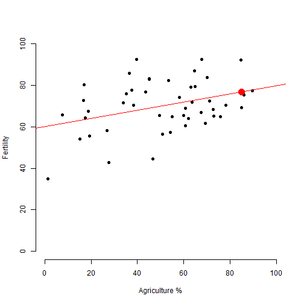

Developing Data Products Week 4 Course Project
========================================================
title: Developing Data Products Week 4 Course Project
author: Ashley Thompson
date: 25/11/2021
autosize: true

Introduction
========================================================

The application, created with Shiny, can be used to predict a value for fertility 
in Switzerland 1888 (‘common standardized fertility measure’), 
using a slider that represents the percentage of males involved
in agriculture as occupation

Application link
- https://ashdt.shinyapps.io/DDP_Course_Project/

Source code link
- https://github.com/ashdtgit/DDP_Course_Project


Data information
========================================================

The data is from the swiss dataset. For this application we are only using the 
Fertility and Agriculture variables.


```r
library(datasets)
library(dplyr)
sws <- select(swiss, 1:2)
head(sws)
```

```
             Fertility Agriculture
Courtelary        80.2        17.0
Delemont          83.1        45.1
Franches-Mnt      92.5        39.7
Moutier           85.8        36.5
Neuveville        76.9        43.5
Porrentruy        76.1        35.3
```

Calculations
========================================================

A prediction model is made from the swiss data, and then the user selects an 
Agricultural percentage with a slider, and the resulting predicted Fertility
is displayed.


```r
##example using 85 as the input
AgInput <- 85
modelAg <- lm(Fertility ~ Agriculture, data = sws)
modelAgPred <- predict(modelAg, newdata = data.frame(Agriculture = AgInput))

modelAgPred
```

```
       1 
76.81152 
```

Example of the plot output
========================================================

A plot is created showing:

- The actual data as black points
- The linear model line as a red line
- The predicted value as a red dot



